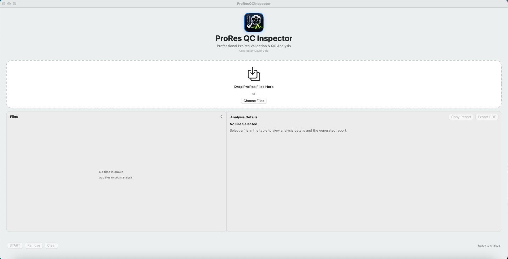

# Media QC Inspector

Version 0.4.0

Media QC Inspector is a native macOS application for validating Apple ProRes media files by detecting decoder errors, extracting technical metadata, identifying affected regions, and generating professional Technical Validation Reports for production workflows.

## Screenshot

## Features

### Analysis
- FFmpeg-based ProRes decoder validation
- Technical metadata extraction
- Automatic decoder error detection
- Error localization
- Editorial review window calculation

### Queue Management
- Drag-and-drop queue
- Add files while analysis is running
- Automatic queue processing
- Stop / Resume analysis
- Remove individual files
- Current file auto-selection

### Live Progress
- Current file progress
- Queue progress
- Elapsed time
- Remaining time estimate
- Live status updates

### Reporting
- Technical Validation Reports
- Rich text report copying
- PDF report export
- Copy report to clipboard
- Professional PASS / FAIL report formatting

### User Interface
- PASS / FAIL status badges
- About window with dynamic version/build information
- Native macOS SwiftUI interface

## Installation

1. Install FFmpeg and FFprobe.
2. Launch Media QC Inspector.
3. Drag one or more ProRes files into the queue.
4. Click **Start** to begin validation.

## Requirements

- macOS
- Apple Silicon or Intel Mac
- FFmpeg / FFprobe (bundled in a future release)

## Roadmap

### v0.5
- Bundle FFmpeg and FFprobe into the application
- Self-contained application (no Homebrew dependency)
- Simplified installation and distribution

### Future
- Additional QC modules
- Batch reporting improvements
- User preferences
- Windows version (long-term)
- Shared cross-platform architecture

See CHANGELOG.md for complete release history.

## License

Copyright © 2026.

License information will be added in a future release.
